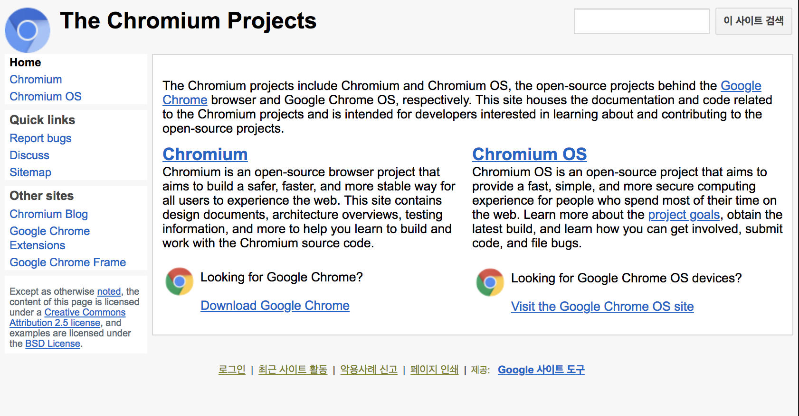

# Markdown
### Header
This is a normal paragraph:

	# This is a H1
	## This is a H2
	### This is a H3
	#### This is a H4
	##### This is a H5
	###### This is a H6

# This is a H1
## This is a H2
### This is a H3
#### This is a H4
##### This is a H5
###### This is a H6

## 블록인용문자

	>this is a blockqute.
	>>this is blockqute.
	>>>this is blockqute.
>this is blockqute.
>>this is blockqute.
>>>this is blockqute.
## 목록
* 순서있는 목록
```
1. first
2. second
3. third
```
1. first
2. second
3. third

* 순서없는 목록
```
* first
* second
* third
```
* first
* second
* third	

## 코드
	코드 사용법
	이렇게 code나 민무뉘 바탕에 글을 적고 싶으면
	1)tab키를 이용해서 들여쓰기를 하게 되면 적용이 된다.
	2)```로 감싸줘도 된다.
	3)~~~로 감싸줘도 된다.

	1)this is Test code:

		markdown!!
	end 

	2)
	this is Test code:
	```
	int main(){
		print("hello world");
	}
	```
	3)
	this is Test code:
	~~~
	int main(){
		print("hello world");
	}
	~~~

1)this is Test code:

	markdown!!
end 

2)this is Test code:
```
int main(){
	print("hello world");
}
```

3)this is Test code:
~~~
int main(){
	print("hello world");
}
~~~
## 링크

* 참조링크

 		[link keyword][id]
		[id]: URL

		ex)[Chromium] https://www.chromium.org/

[Chromium] https://www.chromium.org/

* 인라인 링크

		[Title](link)
 		ex)[Chromium](https://www.chromium.org/)

[Chromium](https://www.chromium.org/)

## 강조

	**Strong Word**
	~~Remove Word~~

**Strong Word**
~~Remove Word~~

## 이미지

	
	
	


## 테이블
```
| header 1  | header 2  |
| :-------- | --------: |
| cell 1    | cell 2    |
| cell 3    | cell 4    |

```
| header 1  | header 2  |
| :-------- | --------: |
| cell 1    | cell 2    |
| cell 3    | cell 4    |

```
| Left Aligned | Centered | Right Aligned | Left Aligned | Centered | Right Aligned |
| :----------- | :------: | ------------: | :----------- | :------: | ------------: |
| Cell 1       | Cell 2   | Cell 3        | Cell 4       | Cell 5   | Cell 6        |
| Cell 7       | Cell 8   | Cell 9        | Cell 10      | Cell 11  | Cell 12       |

```
| Left Aligned | Centered | Right Aligned | Left Aligned | Centered | Right Aligned |
| :----------- | :------: | ------------: | :----------- | :------: | ------------: |
| Cell 1       | Cell 2   | Cell 3        | Cell 4       | Cell 5   | Cell 6        |
| Cell 7       | Cell 8   | Cell 9        | Cell 10      | Cell 11  | Cell 12       |

## 정의 목록
~~~
WordPress
:  세계 최대의 오픈 소스 
저작물 관리 시스템 

Markdown
:  일반 텍스트 문서를
HTML로 변환하는 도구
~~~
WordPress
:  세계 최대의 오픈 소스 
저작물 관리 시스템 

Markdown
:  일반 텍스트 문서를
HTML로 변환하는 도구


## 각주
~~~
각주 [^1] 는 이렇게 만든다.

[^1]: 각주다.
~~~

각주 [^1] 는 이렇게 만든다.

[^1]: 각주다.

### 참고

* [markdown사용법] https://gist.github.com/ihoneymon/652be052a0727ad59601
